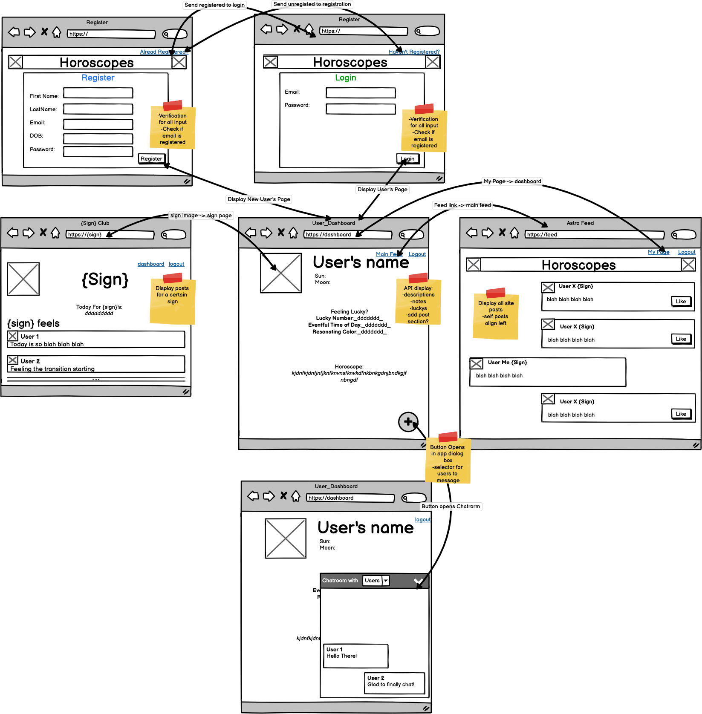
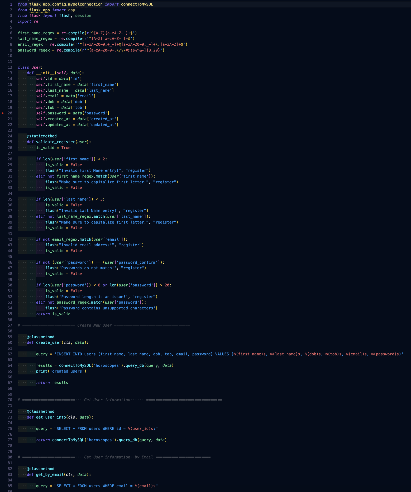
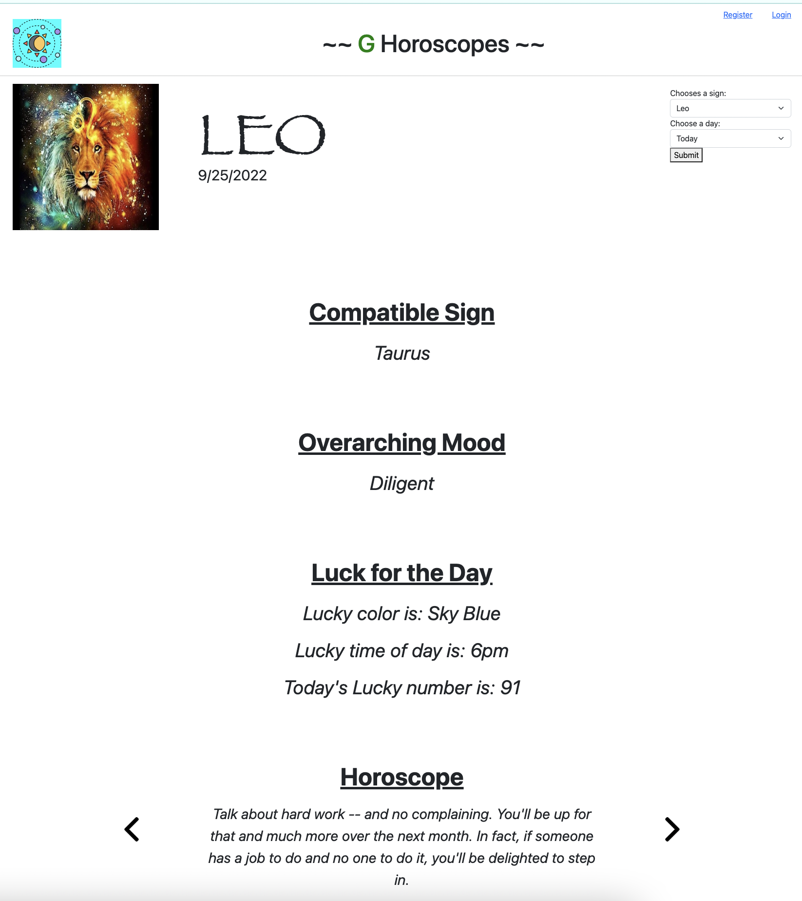
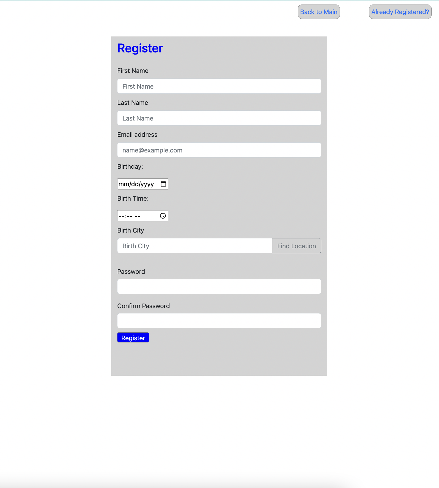

<h1 align="center"><em><strong> Horoscopes </strong></em></h1>

### A Full-Stack Python Flask Application

### Features

- RESTful API requests for Horoscope Information
- bcrypt password hashing for password security
- SQL Database integration for user data storage

### Summary

- As a Guest: 
    
    - Open up your browser to the URL the the application is running on locally and view `Leo's` horoscope provided for today.
    -  Use the  Selectors on the upper right hand side to view horoscopes for other astrological signs.
    -  Use the  Selectors on the upper right hand side to view horoscopes for the previous day and the next day horoscopes.
 

(Discontinued)
- Registered User: 

    - Users can register themselves for an account to get a more detailed view of your horoscope
    - Detailed horoscopes take into account Birthday and Time and is limited if registering user does not provided on the form.
 
 
 

### Photos

- Project Wireframe

- Code Organization Snippet

- Horoscopes Guest Main Page

- Horoscopes Regisration Page

### How to Run Locally

- Instructions Coming Soon....
